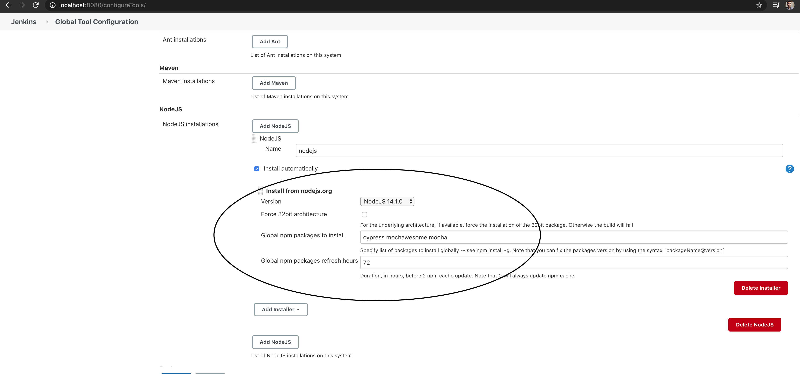
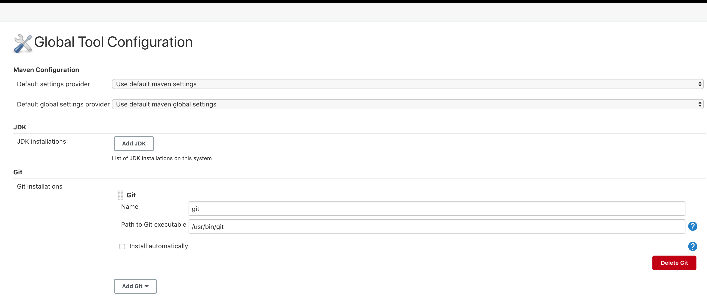
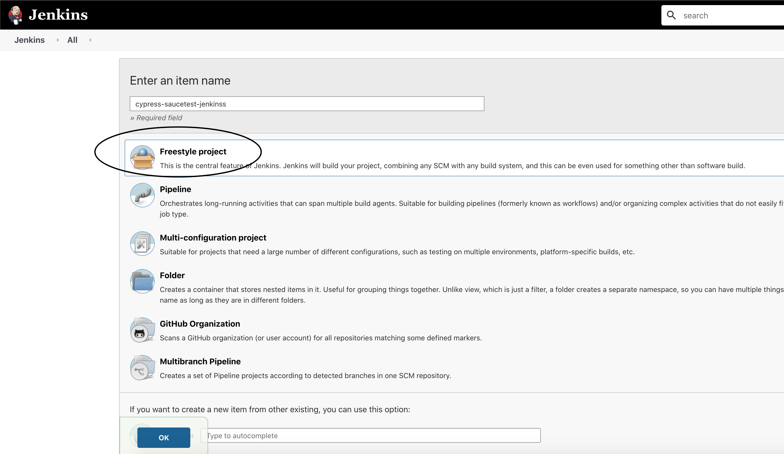
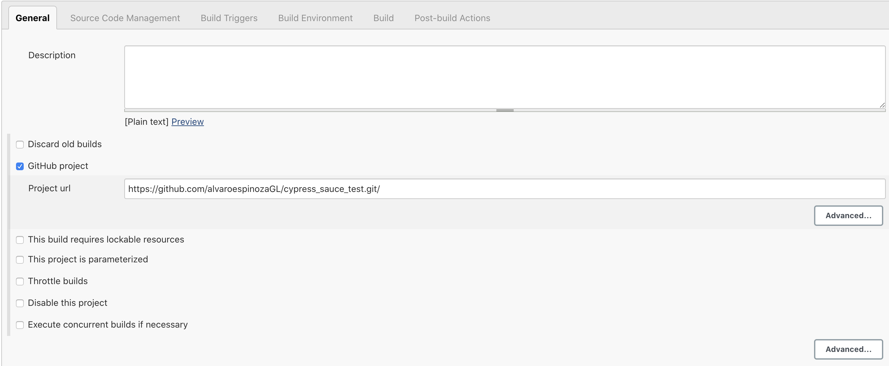
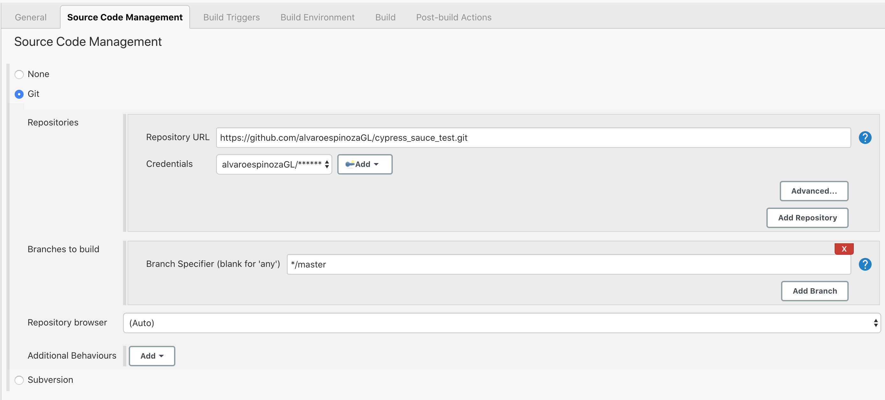
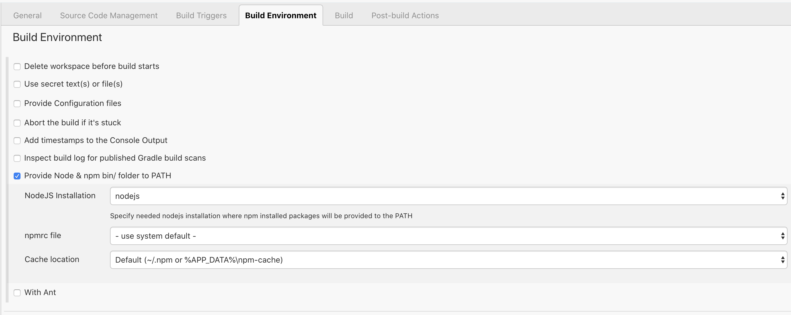
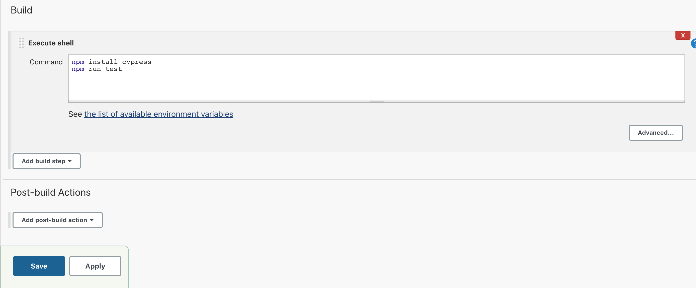

# cypress_sauce_test

# automation Framework Cypress

Node.js with Cypress automated testing project from scratch and follow the structure learned in the video to create tests against the following website:  https://www.saucedemo.com/

The structure should contain tests, functions and elements for the following pages: login, inventory, items (products), cart, checkout.

# before running the test:
1-Installing NodeJS and NPM(https://nodejs.org/en/)
2-Installing Visual Studio Code(https://code.visualstudio.com/)

Follow these steps:

1- Clone the repository

git clone https://github.com/alvaroespinozaGL/cypress_sauce_test.git
cd cypress_sauce_test # to move into the repository folder.
npm install  # to install the dependencies that are located in the package.json file.

2- Start Cypress UI.
npx cypress open

3- Open the IDE and open this repository.

# run the automated script you can follow the next steps.

1- Run all test cases with default configurations on local machine:

npm test
2- Run all tests in Firefox

npm run test-firefox  # this is an alias that will run "cypress run -b firefox"
3- Run all tests in Chrome

npm run test-chrome  # this is an alias that will run "cypress run -b chrome"

# Install Cypress and NodeJs packages on Jenkins

Download & Installation
You can download the latest .hpi(http://updates.jenkins-ci.org/latest/nodejs.hpi) and install it from the Manage Plugins menu, or install this plugin directly from the Plugins Update Center.

After installing the plugin, go to the global jenkins configuration panel (JENKINS_URL/configure or JENKINS_URL/configureTools if using jenkins 2),
and add new NodeJS installations.

For every Nodejs installation, you can choose to install some global npm packages.
Since 1.2.6 you could force the installation of the 32bit package for the underlying architecture if supported. If the package is not available the build will fail.

For our example with Cypress we need to add cypress package on the node js plugin to execute and validate it when it starts building go to http://localhost:8080/configureTools/:
Global npm packages to install: cypress mochawesome mocha

# Configure Git on Jenkins configure tools

make sure you have configured Git on jenkinsURlconfigure tools
Path to Git executable:/usr/bin/git

# Cypress nodeJS Jenkins Project

1- First create new item on Jenkins Main dashboard, then choose a name for your project and select Freestyle project and click ok

2- In the General tab select Github Project and point to your repository .git

3- go to tab Source Code Management and configure your Git repository and if it is private add the credentials 

4- go to the tab Build Environment select Provide Node & npm bin/ folder to PATH and choose nodejs installation

5-the last step will be choose the add build step as Execute Shell and in the script we will run you need to specify npm package to install cypress at the beginning and then run cypress test.

npm install cypress
npm run test

